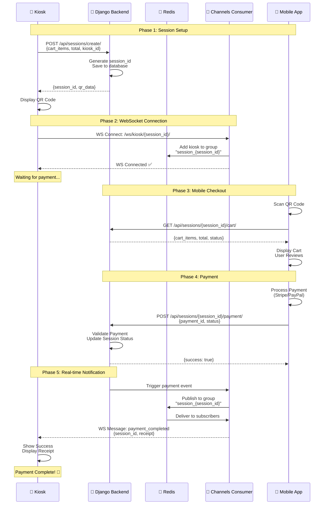

# 🔄 Django Channels WebSocket Flow Diagram

## 📋 Table of Contents

1. [Simple ASCII Flow Diagram](#simple-ascii-flow-diagram)
2. [Step-by-Step Flow](#step-by-step-flow)
3. [Mermaid Sequence Diagram](#mermaid-sequence-diagram)
4. [Component Breakdown](#component-breakdown)
5. [Data Flow Tables](#data-flow-tables)

---

## 🎨 Simple ASCII Flow Diagram

```
┌─────────────┐                                              ┌─────────────┐
│   🏪 KIOSK  │                                              │  📱 MOBILE  │
│             │                                              │     APP     │
└──────┬──────┘                                              └──────┬──────┘
       │                                                            │
       │ 1. Create Session (POST)                                  │
       ├────────────────────────────────►                           │
       │                                 ┌─────────────────┐        │
       │ 2. Session ID + QR Data         │                 │        │
       │◄────────────────────────────────┤  🐍 DJANGO      │        │
       │                                 │    BACKEND      │        │
       │ 3. Display QR Code              │  (REST + WS)    │        │
       │                                 │                 │        │
       │ 4. Connect to WebSocket (WS)    │                 │        │
       ├────────────────────────────────►│                 │        │
       │                                 │  ┌───────────┐  │        │
       │ 5. WebSocket Connected          │  │   Redis   │  │        │
       │◄────────────────────────────────┤  │  Channel  │  │        │
       │    (Listening for payment)      │  │   Layer   │  │        │
       │                                 │  └───────────┘  │        │
       │                                 │                 │        │
       │                                 │                 │  6. Scan QR Code
       │                                 │                 │◄───────┤
       │                                 │                 │        │
       │                                 │  7. Get Cart    │        │
       │                                 │     (GET)       │        │
       │                                 │◄────────────────┤        │
       │                                 │                 │        │
       │                                 │  8. Cart Data   │        │
       │                                 │─────────────────►        │
       │                                 │                 │        │
       │                                 │                 │  9. Process Payment
       │                                 │                 │        │
       │                                 │ 10. Payment     │        │
       │                                 │     Complete    │        │
       │                                 │     (POST)      │        │
       │                                 │◄────────────────┤        │
       │                                 │                 │        │
       │                                 │ 11. Success     │        │
       │                                 │─────────────────►        │
       │                                 │                 │        │
       │ 12. WebSocket Notification      │                 │        │
       │     (payment_completed)         │                 │        │
       │◄────────────────────────────────┤                 │        │
       │                                 │                 │        │
       │ 13. Show Success Message        └─────────────────┘        │
       │     + Receipt                                              │
       │                                                            │
       └────────────────────────────────────────────────────────────┘
```

---

## 📝 Step-by-Step Flow

### Phase 1: Session Creation & QR Display 🏪

**Step 1: Kiosk Creates Checkout Session**

- **Component**: Kiosk Application
- **Action**: POST request to Django backend
- **Data Sent**: Cart items, total amount, kiosk ID
- **Endpoint**: `POST /api/sessions/create/`

**Step 2: Backend Creates Session**

- **Component**: Django Backend
- **Action**: Generate unique session ID, store session data
- **Data Returned**: Session ID, QR code data (URL with session ID)
- **Database**: Session saved to Django database

**Step 3: Kiosk Displays QR Code**

- **Component**: Kiosk Application
- **Action**: Generate and display QR code on screen
- **QR Content**: `https://mobile-app-url.com/checkout/{session_id}`
- **UI**: Large QR code + "Scan to Pay with Mobile App"

**Step 4: Kiosk Opens WebSocket Connection**

- **Component**: Kiosk Application
- **Action**: Connect to Django Channels WebSocket
- **WebSocket URL**: `ws://backend-url/ws/kiosk/{session_id}/`
- **Purpose**: Listen for payment completion events

**Step 5: WebSocket Connection Established**

- **Component**: Django Channels Consumer
- **Action**: Accept WebSocket, join session group
- **Redis**: Kiosk added to session-specific group
- **Status**: Kiosk now waiting for payment notification

---

### Phase 2: Mobile App Interaction 📱

**Step 6: Customer Scans QR Code**

- **Component**: Mobile App
- **Action**: Scan QR code using camera
- **Data Extracted**: Session ID from QR code URL
- **Navigation**: Redirect to checkout page with session ID

**Step 7: Mobile App Requests Cart Data**

- **Component**: Mobile App
- **Action**: GET request to retrieve cart details
- **Endpoint**: `GET /api/sessions/{session_id}/cart/`
- **Authentication**: Session ID validates request

**Step 8: Backend Returns Cart Data**

- **Component**: Django Backend
- **Action**: Fetch session data from database
- **Data Returned**: Cart items, prices, total, session status
- **UI**: Mobile app displays cart for user review

**Step 9: Customer Processes Payment**

- **Component**: Mobile App
- **Action**: User confirms and pays (Stripe, PayPal, etc.)
- **Payment Flow**: Payment gateway integration
- **Status**: Payment processing...

**Step 10: Payment Confirmation to Backend**

- **Component**: Mobile App
- **Action**: POST payment confirmation to backend
- **Endpoint**: `POST /api/sessions/{session_id}/payment/`
- **Data Sent**: Payment ID, status, amount, timestamp

**Step 11: Backend Validates Payment**

- **Component**: Django Backend
- **Action**: Verify payment, update session status
- **Database**: Session marked as "paid"
- **Response**: Payment success confirmation to mobile app

---

### Phase 3: Real-time Notification 🔔

**Step 12: WebSocket Notification Sent**

- **Component**: Django Channels + Redis
- **Action**: Send message to kiosk WebSocket group
- **Message Type**: `payment_completed`
- **Data**: Session ID, payment details, receipt data
- **Delivery**: Instant notification via Redis pub/sub

**Step 13: Kiosk Receives Notification**

- **Component**: Kiosk Application
- **Action**: WebSocket message handler triggered
- **UI Update**: Close QR screen, show success message
- **Next Step**: Display receipt, print if needed

---

## 🔀 Mermaid Sequence Diagram



---

## 🧩 Component Breakdown

### 🏪 Kiosk Application (Frontend)

**Responsibilities:**

- ✅ Create checkout session with cart data
- ✅ Display QR code for mobile scanning
- ✅ Establish WebSocket connection to backend
- ✅ Listen for payment completion events
- ✅ Display receipt/success message when notified
- ✅ Handle timeout if payment not completed

**Technologies:**

- React/Vue/vanilla JavaScript
- WebSocket client library
- QR code generation library

**Key Code:**

```javascript
// Connect to WebSocket
const socket = new WebSocket(`ws://backend/ws/kiosk/${sessionId}/`);

// Listen for payment
socket.onmessage = (event) => {
  const data = JSON.parse(event.data);
  if (data.type === "payment_completed") {
    showSuccessScreen(data.receipt);
  }
};
```

---

### 🐍 Django Backend (REST API + WebSocket)

**Responsibilities:**

- ✅ Provide REST API endpoints for session management
- ✅ Handle WebSocket connections via Django Channels
- ✅ Validate payment requests
- ✅ Send real-time notifications to kiosks
- ✅ Manage session data in database

**Technologies:**

- Django REST Framework (API)
- Django Channels (WebSocket)
- Redis (Channel Layer)
- PostgreSQL/MySQL (Database)

**Key Components:**

**REST API Views:**

```python
# Create session
POST /api/sessions/create/
# Get cart data
GET /api/sessions/{session_id}/cart/
# Process payment
POST /api/sessions/{session_id}/payment/
```

**WebSocket Consumer:**

```python
# Kiosk WebSocket
ws://backend/ws/kiosk/{session_id}/
```

**Channels Consumer Example:**

```python
class KioskConsumer(AsyncWebsocketConsumer):
    async def connect(self):
        self.session_id = self.scope['url_route']['kwargs']['session_id']
        self.group_name = f'session_{self.session_id}'

        # Join session group
        await self.channel_layer.group_add(
            self.group_name,
            self.channel_name
        )
        await self.accept()

    async def payment_completed(self, event):
        # Send to WebSocket
        await self.send(text_data=json.dumps({
            'type': 'payment_completed',
            'session_id': event['session_id'],
            'receipt': event['receipt']
        }))
```

---

### 🔴 Redis (Channel Layer)

**Responsibilities:**

- ✅ Manage WebSocket groups and channels
- ✅ Enable pub/sub messaging between Django instances
- ✅ Deliver real-time notifications to connected clients
- ✅ Scale WebSocket connections across multiple servers

**Configuration:**

```python
CHANNEL_LAYERS = {
    'default': {
        'BACKEND': 'channels_redis.core.RedisChannelLayer',
        'CONFIG': {
            'hosts': [('127.0.0.1', 6379)],
        },
    },
}
```

**How It Works:**

1. Kiosk connects → Added to Redis group `session_{session_id}`
2. Payment completed → Django sends message to Redis
3. Redis broadcasts to all subscribers in group
4. Kiosk receives instant notification

---

### 📱 Mobile App (Frontend)

**Responsibilities:**

- ✅ Scan QR code to get session ID
- ✅ Fetch cart data from backend
- ✅ Display items and total for review
- ✅ Process payment (Stripe, PayPal, etc.)
- ✅ Send payment confirmation to backend

**Technologies:**

- React Native / Flutter / Native iOS/Android
- QR code scanner
- Payment SDK (Stripe, PayPal)

**Key Flow:**

```javascript
// 1. Scan QR
const sessionId = scanQRCode();

// 2. Get cart
const cart = await fetch(`/api/sessions/${sessionId}/cart/`);

// 3. Process payment
const payment = await processPayment(cart.total);

// 4. Confirm to backend
await fetch(`/api/sessions/${sessionId}/payment/`, {
  method: "POST",
  body: JSON.stringify({ payment_id: payment.id }),
});
```

---

## 📊 Data Flow Tables

### HTTP API Endpoints

| Endpoint                      | Method | Caller       | Purpose                 | Request Data                    | Response Data                        |
| ----------------------------- | ------ | ------------ | ----------------------- | ------------------------------- | ------------------------------------ |
| `/api/sessions/create/`       | POST   | Kiosk        | Create checkout session | `{cart_items, total, kiosk_id}` | `{session_id, qr_data, expires_at}`  |
| `/api/sessions/{id}/cart/`    | GET    | Mobile       | Get cart details        | Session ID in URL               | `{items, total, status, created_at}` |
| `/api/sessions/{id}/payment/` | POST   | Mobile       | Submit payment          | `{payment_id, amount, method}`  | `{success, receipt_id, message}`     |
| `/api/sessions/{id}/status/`  | GET    | Kiosk/Mobile | Check session status    | Session ID in URL               | `{status, paid, updated_at}`         |

---

### WebSocket Events

| Event Type          | Direction       | Sender | Receiver        | Data                            | Purpose                 |
| ------------------- | --------------- | ------ | --------------- | ------------------------------- | ----------------------- |
| `connection_opened` | Client → Server | Kiosk  | Django Channels | `{session_id}`                  | Establish WS connection |
| `payment_completed` | Server → Client | Django | Kiosk           | `{session_id, receipt, amount}` | Notify payment success  |
| `session_expired`   | Server → Client | Django | Kiosk           | `{session_id, reason}`          | Notify timeout          |
| `error`             | Server → Client | Django | Kiosk           | `{error_code, message}`         | Error notification      |

---

### Session Data Structure

**Database Model (Django):**

```python
{
  "session_id": "uuid-v4",
  "kiosk_id": "kiosk_001",
  "cart_items": [
    {"item": "Coffee", "price": 4.50, "qty": 2},
    {"item": "Donut", "price": 2.00, "qty": 1}
  ],
  "total": 11.00,
  "status": "pending|paid|expired",
  "payment_id": "stripe_payment_id",
  "created_at": "2025-10-07T02:30:00Z",
  "expires_at": "2025-10-07T02:35:00Z",
  "paid_at": null
}
```

---

### Redis Channel Groups

| Group Name             | Members                    | Purpose                                            | Lifetime                                |
| ---------------------- | -------------------------- | -------------------------------------------------- | --------------------------------------- |
| `session_{session_id}` | Kiosk WebSocket connection | Receive payment notifications for specific session | Until session expires or WS disconnects |

---

## 🔐 Security Considerations

- ✅ **Session Expiration**: Sessions expire after 5-10 minutes
- ✅ **One-Time Use**: Each session can only be paid once
- ✅ **Payment Validation**: Verify payment with payment gateway
- ✅ **WebSocket Auth**: Validate session ID before accepting connection
- ✅ **HTTPS/WSS**: Use secure connections in production
- ✅ **Rate Limiting**: Prevent abuse of API endpoints

---

## 🚀 Quick Start Summary

1. **Kiosk**: Create session → Get QR → Display → Connect WebSocket
2. **Mobile**: Scan QR → Get cart → Pay → Confirm payment
3. **Backend**: Validate payment → Send WebSocket notification
4. **Kiosk**: Receive notification → Show success → Print receipt

---

## 📚 Additional Resources

- [Django Channels Documentation](https://channels.readthedocs.io/)
- [Django REST Framework](https://www.django-rest-framework.org/)
- [Redis Channel Layer](https://github.com/django/channels_redis)
- [WebSocket API](https://developer.mozilla.org/en-US/docs/Web/API/WebSocket)

---

**Created**: 2025-10-07  
**Purpose**: Visual guide for Django Channels WebSocket integration  
**System**: Kiosk ↔ Mobile App payment flow
