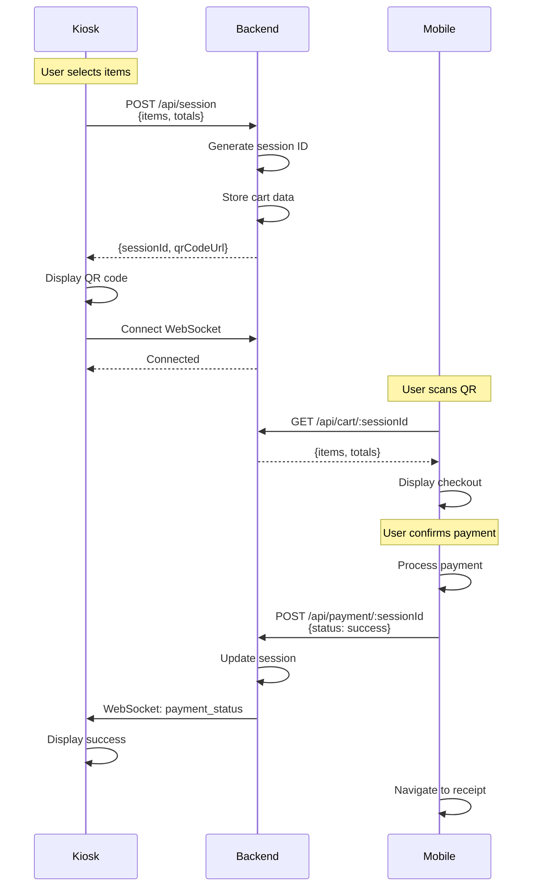

# Kiosk-to-Mobile Checkout Integration Architecture

## Table of Contents

1. [Overview](#overview)
2. [Architecture Diagram](#architecture-diagram)
3. [System Components](#system-components)
4. [QR Code Generation & Data Transfer](#qr-code-generation--data-transfer)
5. [Data Flow Architecture](#data-flow-architecture)
6. [Transaction Notification System](#transaction-notification-system)
7. [Technology Stack](#technology-stack)
8. [Complete Workflow](#complete-workflow)
9. [Code Examples](#code-examples)
10. [Security Considerations](#security-considerations)
11. [Alternative Approaches](#alternative-approaches)
12. [Implementation Roadmap](#implementation-roadmap)
13. [Error Handling & Edge Cases](#error-handling--edge-cases)

---

## Overview

This architecture enables a seamless checkout experience where customers scan a QR code at a physical kiosk, complete their purchase on their mobile device, and the kiosk receives real-time transaction updates.

### Key Requirements

- **Platform**: Web-based kiosk (React/HTML)
- **Network**: Same local network
- **Payment**: Demo/simulated payment flow
- **Scale**: Single kiosk prototype (scalable design)
- **Mobile App**: Existing Vite + React + Tailwind checkout application

---

## Architecture Diagram

```
┌─────────────────────────────────────────────────────────────────────┐
│                         KIOSK-TO-MOBILE FLOW                        │
└─────────────────────────────────────────────────────────────────────┘

┌──────────────┐         ┌──────────────┐         ┌──────────────┐
│              │         │              │         │              │
│    KIOSK     │────1───▶│   BACKEND    │◀───2────│    MOBILE    │
│   (React)    │         │   SERVER     │         │     APP      │
│              │         │  (Node.js)   │         │   (React)    │
│              │◀───6────│              │────5───▶│              │
└──────────────┘         └──────────────┘         └──────────────┘
      │                         │                         │
      │                         │                         │
      ▼                         ▼                         ▼
┌──────────────┐         ┌──────────────┐         ┌──────────────┐
│ Display QR   │         │  WebSocket   │         │ Scan QR &    │
│ Generate     │         │  Connection  │         │ Load Cart    │
│ Session      │         │  Manager     │         │              │
└──────────────┘         └──────────────┘         └──────────────┘
      │                         │                         │
      │                         │                         │
      ▼                         ▼                         ▼
┌──────────────┐         ┌──────────────┐         ┌──────────────┐
│ Wait for     │         │  Session     │         │ Complete     │
│ Transaction  │         │  Storage     │         │ Payment      │
│ Status       │         │              │         │              │
└──────────────┘         └──────────────┘         └──────────────┘


STEP-BY-STEP FLOW:
═══════════════════

1. Kiosk creates session → Backend stores cart data
2. Mobile scans QR → Backend retrieves cart data
3. Mobile displays checkout → User reviews items
4. Mobile processes payment → Demo payment success
5. Backend receives payment status → Updates session
6. Kiosk receives notification → Shows success/failure

```

### Detailed Architecture Flow

```
                    ┌─────────────────────────┐
                    │   Physical Kiosk        │
                    │   (Touch Screen)        │
                    └───────────┬─────────────┘
                                │
                    ┌───────────▼──────────────┐
                    │  Kiosk Web App (React)   │
                    │  - Product Selection     │
                    │  - Cart Management       │
                    │  - QR Code Display       │
                    │  - WebSocket Client      │
                    └───────────┬──────────────┘
                                │
                    ┌───────────▼──────────────┐
                    │  Backend Server          │
                    │  (Express.js + Socket.io)│
                    │                          │
                    │  ┌────────────────────┐  │
                    │  │ REST API           │  │
                    │  │ - POST /session    │  │
                    │  │ - GET /cart/:id    │  │
                    │  │ - POST /payment    │  │
                    │  └────────────────────┘  │
                    │                          │
                    │  ┌────────────────────┐  │
                    │  │ WebSocket Server   │  │
                    │  │ - Kiosk connections│  │
                    │  │ - Event broadcasting│ │
                    │  └────────────────────┘  │
                    │                          │
                    │  ┌────────────────────┐  │
                    │  │ Session Store      │  │
                    │  │ (In-Memory/Redis)  │  │
                    │  └────────────────────┘  │
                    └───────────┬──────────────┘
                                │
                    ┌───────────▼──────────────┐
                    │  Mobile Device           │
                    │  (Customer's Phone)      │
                    │                          │
                    │  ┌────────────────────┐  │
                    │  │ Mobile Web App     │  │
                    │  │ (React + Vite)     │  │
                    │  │ - Scan QR          │  │
                    │  │ - Load Cart        │  │
                    │  │ - Process Payment  │  │
                    │  │ - Send Confirmation│  │
                    │  └────────────────────┘  │
                    └──────────────────────────┘
```

---

## System Components

### 1. Kiosk Application (React)

**Responsibilities:**

- Display products and allow selection
- Generate cart with selected items
- Create checkout session via backend API
- Display QR code with session ID
- Maintain WebSocket connection to backend
- Listen for transaction status updates
- Display success/failure UI

### 2. Backend Server (Node.js + Express + Socket.io)

**Responsibilities:**

- Create and manage checkout sessions
- Store cart data temporarily
- Serve cart data to mobile app
- Handle payment confirmations
- Broadcast transaction status to kiosk via WebSocket
- Session cleanup and expiration

### 3. Mobile Checkout App (React)

**Responsibilities:**

- Scan QR code (or receive URL with session ID)
- Fetch cart data from backend
- Display checkout interface
- Process payment (demo mode)
- Send payment status to backend
- Display receipt

---

## QR Code Generation & Data Transfer

### Strategy 1: Session ID Only (Recommended for Local Network)

**Approach:**

- Kiosk generates a unique session ID
- Cart data is stored on backend server
- QR code contains only the session ID in URL
- Mobile app fetches full cart data from backend

**QR Code Format:**

```
http://192.168.1.100:5173/checkout?session=abc123xyz789
```

**Advantages:**
✅ Small QR code (fast scanning)
✅ Secure - no sensitive data in QR
✅ Flexible - can update cart server-side
✅ Supports large carts without QR size limits

**Disadvantages:**
❌ Requires backend server
❌ Mobile device needs network access

### Strategy 2: Embedded Cart Data (Offline Alternative)

**Approach:**

- Entire cart data encoded in QR code
- No backend dependency for initial load
- Can work offline after QR scan

**QR Code Format:**

```
http://192.168.1.100:5173/checkout?data=eyJpdGVtcyI6W3siaWQiOjEsIm5hbWUiOi...
```

**Advantages:**
✅ No backend required for cart data
✅ Works offline after scan
✅ Simpler architecture

**Disadvantages:**
❌ Large QR codes (slow scanning)
❌ Limited cart size (URL length limits)
❌ Cart data exposed in URL
❌ Cannot update cart after QR generation

### Recommended Approach: **Strategy 1 (Session ID)**

For a professional, scalable solution with the best user experience.

---

## Data Flow Architecture

### Phase 1: Session Creation (Kiosk → Backend)

```javascript
// Kiosk creates session
POST /api/session
Request:
{
  "kioskId": "KIOSK-001",
  "items": [
    { "id": 1, "name": "Wireless Headphones", "price": 79.99, "quantity": 1 },
    { "id": 2, "name": "Phone Case", "price": 24.99, "quantity": 2 }
  ],
  "subtotal": 129.97,
  "tax": 10.40,
  "total": 140.37
}

Response:
{
  "sessionId": "550e8400-e29b-41d4-a716-446655440000",
  "qrCodeUrl": "http://192.168.1.100:5173/checkout?session=550e8400-e29b-41d4-a716-446655440000",
  "expiresAt": "2025-10-06T08:23:27Z"
}
```

### Phase 2: Cart Retrieval (Mobile → Backend)

```javascript
// Mobile fetches cart data
GET /api/cart/:sessionId

Response:
{
  "sessionId": "550e8400-e29b-41d4-a716-446655440000",
  "kioskId": "KIOSK-001",
  "items": [...],
  "subtotal": 129.97,
  "tax": 10.40,
  "total": 140.37,
  "status": "pending",
  "createdAt": "2025-10-06T08:23:27Z"
}
```

### Phase 3: Payment Notification (Mobile → Backend → Kiosk)

```javascript
// Mobile sends payment confirmation
POST /api/payment/:sessionId
Request:
{
  "status": "success", // or "failed"
  "paymentMethod": "demo",
  "transactionId": "TXN-1728200607",
  "timestamp": "2025-10-06T08:25:30Z"
}

Response:
{
  "success": true,
  "receiptUrl": "/receipt?order=ORD-1728200607"
}

// Backend broadcasts to kiosk via WebSocket
WebSocket Event:
{
  "event": "payment_status",
  "sessionId": "550e8400-e29b-41d4-a716-446655440000",
  "status": "success",
  "transactionId": "TXN-1728200607"
}
```

---

## Transaction Notification System

### Recommended: WebSocket (Socket.io)

**Why WebSockets?**

- Real-time, bidirectional communication
- Low latency for instant notifications
- Connection-based (maintains state)
- Perfect for local network scenarios
- Built-in reconnection logic

### WebSocket Flow

```
Kiosk                          Backend                        Mobile
  │                               │                              │
  │──── Connect WebSocket ────────▶│                              │
  │                               │                              │
  │◀─── Connection Confirmed ─────│                              │
  │     room: session-550e8400    │                              │
  │                               │                              │
  │                               │◀──── POST /payment ──────────│
  │                               │      status: success         │
  │                               │                              │
  │                               │──── Validate & Store ────────│
  │                               │                              │
  │◀─── payment_status event ─────│                              │
  │     { status: "success",      │                              │
  │       sessionId: "...",        │                              │
  │       transactionId: "..." }  │                              │
  │                               │                              │
  │──── Display Success Screen ───│                              │
  │                               │                              │
```

### Alternative: Server-Sent Events (SSE)

**Simpler unidirectional alternative:**

```javascript
// Kiosk subscribes to session events
GET /api/events/:sessionId

// Backend sends events
event: payment_status
data: {"status":"success","transactionId":"TXN-123"}
```

**Comparison:**

| Feature         | WebSocket (Recommended) | SSE           | Polling        |
| --------------- | ----------------------- | ------------- | -------------- |
| Real-time       | ✅ Excellent            | ✅ Good       | ❌ Poor        |
| Bidirectional   | ✅ Yes                  | ❌ No         | ❌ No          |
| Complexity      | Medium                  | Low           | Very Low       |
| Browser Support | ✅ Excellent            | ✅ Excellent  | ✅ Universal   |
| Reconnection    | ✅ Built-in             | ✅ Built-in   | Manual         |
| Best For        | Interactive apps        | Notifications | Simple polling |

---

## Technology Stack

### Backend Server (Recommended)

```json
{
  "runtime": "Node.js 18+",
  "framework": "Express.js 4.18+",
  "realtime": "Socket.io 4.6+",
  "session": "express-session + connect-redis (or in-memory)",
  "cors": "cors",
  "validation": "joi or zod",
  "uuid": "uuid v4"
}
```

### Kiosk Application (React)

```json
{
  "framework": "React 18+",
  "build": "Vite 5+",
  "styling": "Tailwind CSS",
  "qr": "qrcode.react",
  "websocket": "socket.io-client",
  "http": "axios"
}
```

### Mobile Application (Existing)

```json
{
  "framework": "React 18 ✅ (already installed)",
  "http": "axios ✅ (already installed)",
  "routing": "react-router-dom ✅ (already installed)",
  "qr": "html5-qrcode (for QR scanning)",
  "websocket": "optional - for real-time updates"
}
```

### Storage Options

**For Demo/Prototype:**

- **In-Memory Store**: Simple JavaScript Map or Object
- **Session Duration**: 30 minutes
- **Auto-cleanup**: setInterval cleanup of expired sessions

**For Production:**

- **Redis**: Fast, reliable session storage
- **MongoDB**: If persistent history is needed
- **PostgreSQL**: For full transaction records

### Development Tools

```json
{
  "dev": "nodemon (backend hot reload)",
  "cors": "Configure for local network IPs",
  "env": "dotenv for configuration",
  "logging": "winston or pino",
  "testing": "jest + supertest"
}
```

---

## Complete Workflow

### Step-by-Step Process

#### 1. Customer Approaches Kiosk

```
User Action: Browses products on kiosk touchscreen
Kiosk: Displays available products
User Action: Selects items and quantities
Kiosk: Updates cart in real-time
```

#### 2. Cart Finalization

```
User Action: Taps "Checkout" button
Kiosk Action:
  1. Calculates totals (subtotal + tax)
  2. Sends POST /api/session with cart data
  3. Receives sessionId and QR code URL
  4. Establishes WebSocket connection to backend
  5. Displays QR code on screen
  6. Shows "Scan to Pay on Your Phone" message
```

#### 3. QR Code Scanning

```
User Action: Scans QR code with phone camera
Mobile: Opens URL in browser
  Example: http://192.168.1.100:5173/checkout?session=550e8400...

Mobile App:
  1. Extracts sessionId from URL params
  2. Sends GET /api/cart/:sessionId
  3. Receives cart data from backend
  4. Displays checkout page with items
```

#### 4. Order Review

```
Mobile: Shows cart items, prices, totals
User Action: Reviews order
User Action: Taps "Pay Now" button
```

#### 5. Payment Processing (Demo)

```
Mobile App:
  1. Simulates payment processing (1-2 second delay)
  2. Generates transaction ID
  3. Sends POST /api/payment/:sessionId
     {
       "status": "success",
       "paymentMethod": "demo",
       "transactionId": "TXN-1728200607"
     }
  4. Navigates to receipt page
  5. Displays success message
```

#### 6. Kiosk Notification

```
Backend:
  1. Receives payment confirmation
  2. Updates session status to "completed"
  3. Broadcasts WebSocket event to kiosk
     {
       "event": "payment_status",
       "sessionId": "550e8400...",
       "status": "success"
     }

Kiosk:
  1. Receives WebSocket event
  2. Hides QR code
  3. Displays success animation
  4. Shows "Thank you! Payment Received" message
  5. Resets to product selection after 5 seconds
```

#### 7. Receipt Generation

```
Mobile: Displays digital receipt
  - Order number
  - Items purchased
  - Totals
  - Download options (PNG/PDF)

User Action: Downloads receipt or continues shopping
User Action: Closes browser/app
```

### Timing & Timeouts

- **Session Creation**: < 100ms
- **QR Code Display**: Instant
- **QR Scan to Cart Load**: < 500ms
- **Payment Processing**: 1-2s (demo simulation)
- **Kiosk Notification**: < 100ms (WebSocket)
- **Session Expiration**: 30 minutes
- **WebSocket Reconnection**: Automatic with exponential backoff

---

## Code Examples

### Backend Server (Node.js + Express + Socket.io)

#### server.js

```javascript
const express = require("express");
const http = require("http");
const { Server } = require("socket.io");
const cors = require("cors");
const { v4: uuidv4 } = require("uuid");

const app = express();
const server = http.createServer(app);
const io = new Server(server, {
  cors: {
    origin: ["http://192.168.1.100:5173", "http://localhost:5173"],
    methods: ["GET", "POST"],
  },
});

// Middleware
app.use(cors());
app.use(express.json());

// In-memory session store (use Redis for production)
const sessions = new Map();
const kioskSockets = new Map(); // Map sessionId to socket

// Session expiration cleanup (every 5 minutes)
setInterval(() => {
  const now = Date.now();
  for (const [sessionId, session] of sessions.entries()) {
    if (now > session.expiresAt) {
      sessions.delete(sessionId);
      console.log(`Session expired: ${sessionId}`);
    }
  }
}, 5 * 60 * 1000);

// ===== REST API ENDPOINTS =====

// Create checkout session
app.post("/api/session", (req, res) => {
  const { kioskId, items, subtotal, tax, total } = req.body;

  const sessionId = uuidv4();
  const expiresAt = Date.now() + 30 * 60 * 1000; // 30 minutes

  const session = {
    sessionId,
    kioskId,
    items,
    subtotal,
    tax,
    total,
    status: "pending",
    createdAt: new Date().toISOString(),
    expiresAt,
  };

  sessions.set(sessionId, session);

  const mobileUrl = `http://192.168.1.100:5173/checkout?session=${sessionId}`;

  res.json({
    sessionId,
    qrCodeUrl: mobileUrl,
    expiresAt: new Date(expiresAt).toISOString(),
  });

  console.log(`Session created: ${sessionId}`);
});

// Get cart data
app.get("/api/cart/:sessionId", (req, res) => {
  const { sessionId } = req.params;

  const session = sessions.get(sessionId);

  if (!session) {
    return res.status(404).json({ error: "Session not found or expired" });
  }

  if (Date.now() > session.expiresAt) {
    sessions.delete(sessionId);
    return res.status(410).json({ error: "Session expired" });
  }

  res.json(session);
  console.log(`Cart retrieved: ${sessionId}`);
});

// Process payment
app.post("/api/payment/:sessionId", (req, res) => {
  const { sessionId } = req.params;
  const { status, paymentMethod, transactionId } = req.body;

  const session = sessions.get(sessionId);

  if (!session) {
    return res.status(404).json({ error: "Session not found" });
  }

  // Update session
  session.status = status;
  session.paymentMethod = paymentMethod;
  session.transactionId = transactionId;
  session.completedAt = new Date().toISOString();

  // Notify kiosk via WebSocket
  const kioskSocket = kioskSockets.get(sessionId);
  if (kioskSocket) {
    kioskSocket.emit("payment_status", {
      sessionId,
      status,
      transactionId,
      timestamp: session.completedAt,
    });
    console.log(`Payment notification sent to kiosk: ${sessionId}`);
  }

  res.json({
    success: true,
    receiptUrl: `/receipt?order=${transactionId}`,
  });

  console.log(`Payment processed: ${sessionId} - ${status}`);
});

// Health check
app.get("/api/health", (req, res) => {
  res.json({
    status: "ok",
    activeSessions: sessions.size,
    connectedKiosks: kioskSockets.size,
  });
});

// ===== WEBSOCKET HANDLING =====

io.on("connection", (socket) => {
  console.log(`Client connected: ${socket.id}`);

  // Kiosk registers for session notifications
  socket.on("register_kiosk", (data) => {
    const { sessionId } = data;
    kioskSockets.set(sessionId, socket);
    socket.join(`session-${sessionId}`);
    console.log(`Kiosk registered for session: ${sessionId}`);

    socket.emit("registered", { sessionId });
  });

  // Handle disconnection
  socket.on("disconnect", () => {
    // Remove from kioskSockets map
    for (const [sessionId, sock] of kioskSockets.entries()) {
      if (sock.id === socket.id) {
        kioskSockets.delete(sessionId);
        console.log(`Kiosk disconnected from session: ${sessionId}`);
      }
    }
    console.log(`Client disconnected: ${socket.id}`);
  });
});

// Start server
const PORT = process.env.PORT || 3001;
server.listen(PORT, "0.0.0.0", () => {
  console.log(`Backend server running on http://0.0.0.0:${PORT}`);
  console.log(`WebSocket server ready`);
});
```

#### package.json (Backend)

```json
{
  "name": "checkout-backend",
  "version": "1.0.0",
  "type": "module",
  "scripts": {
    "start": "node server.js",
    "dev": "nodemon server.js"
  },
  "dependencies": {
    "express": "^4.18.2",
    "socket.io": "^4.6.1",
    "cors": "^2.8.5",
    "uuid": "^9.0.0"
  },
  "devDependencies": {
    "nodemon": "^3.0.1"
  }
}
```

### Kiosk Application Updates

#### KioskCheckout.jsx

```javascript
import { useState, useEffect } from 'react';
import QRCode from 'qrcode.react';
import { io } from 'socket.io-client';
import axios from 'axios';

const BACKEND_URL = 'http://192.168.1.100:3001';

const KioskCheckout = () => {
  const [cart, setCart] = useState([]);
  const [qrCodeUrl, setQrCodeUrl] = useState(null);
  const [sessionId, setSessionId] = useState(null);
  const [paymentStatus, setPaymentStatus] = useState('idle'); // idle, waiting, success, failed
  const [socket, setSocket] = useState(null);

  // Sample products
  const products = [
    { id: 1, name: 'Wireless Headphones', price: 79.99, image: '🎧' },
    { id: 2, name: 'Phone Case', price: 24.99, image: '📱' },
    { id: 3, name: 'USB-C Cable', price: 12.99, image: '🔌' },
  ];

  const addToCart = (product) => {
    const existingItem = cart.find(item => item.id === product.id);
    if (existingItem) {
      setCart(cart.map(item =>
        item.id === product.id
          ? { ...item, quantity: item.quantity + 1 }
          : item
      ));
    } else {
      setCart([...cart, { ...product, quantity: 1 }]);
    }
  };

  const calculateTotals = () => {
    const subtotal = cart.reduce((sum, item) => sum + (item.price * item.quantity), 0);
    const tax = subtotal * 0.08;
    const total = subtotal + tax;
    return { subtotal, tax, total };
  };

  const handleCheckout = async () => {
    const { subtotal, tax, total } = calculateTotals();

    try {
      const response = await axios.post(`${BACKEND_URL}/api/session`, {
        kioskId: 'KIOSK-001',
        items: cart,
        subtotal: subtotal.toFixed(2),
        tax: tax.toFixed(2),
        total: total.toFixed(2)
      });

      const { sessionId, qrCodeUrl } = response.data;
      setSessionId(sessionId);
      setQrCodeUrl(qrCodeUrl);
      setPaymentStatus('waiting');

      // Connect to WebSocket
      const newSocket = io(BACKEND_URL);
      setSocket(newSocket);

      newSocket.on('connect', () => {
        console.log('Connected to backend');
        newSocket.emit('register_kiosk', { sessionId });
      });

      newSocket.on('payment_status', (data) => {
        console.log('Payment status received:', data);
        setPaymentStatus(data.status);

        // Reset after 5 seconds
        setTimeout(() => {
          resetKiosk();
        }, 5000);
      });

    } catch (error) {
      console.error('Error creating session:', error);
      alert('Failed to create checkout session');
    }
  };

  const resetKiosk = () => {
    setCart([]);
    setQrCodeUrl(null);
    setSessionId(null);
    setPaymentStatus('idle');
    if (socket) {
      socket.disconnect();
      setSocket(null);
    }
  };

  useEffect(() => {
    return () => {
      if (socket) {
        socket.disconnect();
      }
    };
  }, [socket]);

  return (
    <div className="min-h-screen bg-gray-100 p-8">
      <div className="max-w-6xl mx-auto">
        <h1 className="text-4xl font-bold mb-8 text-center">Kiosk Checkout</h1>

        {paymentStatus === 'idle' && (
          <>
            {/* Products Grid */}
            <div className="grid grid-cols-3 gap-4 mb-8">
              {products.map(product => (
                <button
                  key={product.id}
                  onClick={() => addToCart(product)}
                  className="bg-white p-6 rounded-lg shadow-lg hover:shadow-xl transition-shadow">
                  <div className="text-6xl mb-4">{product.image}</div>
                  <h3 className="font-bold text-lg mb-2">{product.name}</h3>
                  <p className="text-2xl text-blue-600">${product.price}</p>
                </button>
              ))}
            </div>

            {/* Cart */}
            {cart.length > 0 && (
              <div className="bg-white rounded-lg shadow-lg p-6 mb-8">
                <h2 className="text-2xl font-bold mb-4">Shopping Cart</h2>
                {cart.map(item => (
                  <div key={item.id} className="flex justify-between items-center mb-2">
                    <span>{item.name} x {item.quantity}</span>
                    <span className="font-bold">${(item.price * item.quantity).toFixed(2)}</span>
                  </div>
                ))}
                <div className="border-t pt-4 mt-4">
                  <div className="flex justify-between text-xl font-bold">
                    <span>Total:</span>
                    <span>${calculateTotals().total.toFixed(2)}</span>
                  </div>
                </div>
                <button
                  onClick={handleCheckout}
                  className="w-full mt-6 bg-blue-600 hover:bg-blue-700 text-white font-bold py-4 px-6 rounded-lg text-xl">
                  Proceed to Checkout
                </button>
              </div>
            )}
          </>
        )}

        {paymentStatus === 'waiting' && qrCodeUrl && (
          <div className="bg-white rounded-lg shadow-lg p-12 text-center">
            <h2 className="text-3xl font-bold mb-8">Scan to Pay on Your Phone</h2>
            <div className="flex justify-center mb-8">
              <QRCode value={qrCodeUrl} size={400} level="H" />
            </div>
```

            <p className="text-gray-600 text-xl">Waiting for payment...</p>
            <div className="mt-4">
              <div className="animate-pulse flex space-x-2 justify-center">
                <div className="w-3 h-3 bg-blue-600 rounded-full"></div>
                <div className="w-3 h-3 bg-blue-600 rounded-full"></div>
                <div className="w-3 h-3 bg-blue-600 rounded-full"></div>
              </div>
            </div>
          </div>
        )}

        {paymentStatus === 'success' && (
          <div className="bg-green-500 text-white rounded-lg shadow-lg p-12 text-center">
            <div className="text-8xl mb-8">✅</div>
            <h2 className="text-4xl font-bold mb-4">Payment Successful!</h2>
            <p className="text-2xl">Thank you for your purchase</p>
            <p className="text-xl mt-4 opacity-90">Resetting in 5 seconds...</p>
          </div>
        )}

        {paymentStatus === 'failed' && (
          <div className="bg-red-500 text-white rounded-lg shadow-lg p-12 text-center">
            <div className="text-8xl mb-8">❌</div>
            <h2 className="text-4xl font-bold mb-4">Payment Failed</h2>
            <p className="text-2xl">Please try again</p>
            <button
              onClick={resetKiosk}
              className="mt-6 bg-white text-red-500 font-bold py-4 px-8 rounded-lg text-xl">
              Start Over
            </button>
          </div>
        )}
      </div>
    </div>

);
};

export default KioskCheckout;

````

### Mobile App Updates

#### Checkout.jsx (Updated)

```javascript
import { useState, useEffect } from "react";
import { useNavigate, useSearchParams } from "react-router-dom";
import { ShoppingCart, ChevronRight, Package } from "lucide-react";
import axios from "axios";

const BACKEND_URL = 'http://192.168.1.100:3001';

const Checkout = () => {
  const navigate = useNavigate();
  const [searchParams] = useSearchParams();
  const sessionId = searchParams.get('session');

  const [cartItems, setCartItems] = useState([]);
  const [loading, setLoading] = useState(true);
  const [error, setError] = useState(null);
  const [subtotal, setSubtotal] = useState(0);
  const [tax, setTax] = useState(0);
  const [total, setTotal] = useState(0);

  useEffect(() => {
    if (sessionId) {
      fetchCartData();
    } else {
      // Fallback to demo data if no session
      loadDemoData();
    }
  }, [sessionId]);

  const fetchCartData = async () => {
    try {
      setLoading(true);
      const response = await axios.get(`${BACKEND_URL}/api/cart/${sessionId}`);
      const data = response.data;

      setCartItems(data.items);
      setSubtotal(parseFloat(data.subtotal));
      setTax(parseFloat(data.tax));
      setTotal(parseFloat(data.total));
      setLoading(false);
    } catch (err) {
      console.error('Error fetching cart:', err);
      setError('Failed to load cart data. Please scan the QR code again.');
      setLoading(false);
    }
  };

  const loadDemoData = () => {
    // Fallback demo data
    const demoItems = [
      { id: 1, name: "Wireless Headphones", price: 79.99, quantity: 1, image: "🎧" },
      { id: 2, name: "Phone Case", price: 24.99, quantity: 2, image: "📱" },
      { id: 3, name: "USB-C Cable", price: 12.99, quantity: 1, image: "🔌" }
    ];

    setCartItems(demoItems);
    const sub = demoItems.reduce((sum, item) => sum + item.price * item.quantity, 0);
    const t = sub * 0.08;
    setSubtotal(sub);
    setTax(t);
    setTotal(sub + t);
    setLoading(false);
  };

  const handlePayNow = async () => {
    // Simulate payment processing
    await new Promise(resolve => setTimeout(resolve, 1500));

    const transactionId = `TXN-${Date.now()}`;
    const orderData = {
      items: cartItems,
      subtotal: subtotal.toFixed(2),
      tax: tax.toFixed(2),
      total: total.toFixed(2),
      timestamp: new Date().toISOString(),
      orderNumber: `ORD-${Date.now()}`,
      transactionId
    };

    // Store in session storage for receipt
    sessionStorage.setItem("orderData", JSON.stringify(orderData));

    // Notify backend if session exists
    if (sessionId) {
      try {
        await axios.post(`${BACKEND_URL}/api/payment/${sessionId}`, {
          status: 'success',
          paymentMethod: 'demo',
          transactionId,
          timestamp: new Date().toISOString()
        });
      } catch (err) {
        console.error('Error notifying backend:', err);
        // Continue anyway - receipt will still work
      }
    }

    // Navigate to receipt
    navigate("/receipt");
  };

  if (loading) {
    return (
      <div className="min-h-screen bg-gray-50 flex items-center justify-center">
        <div className="text-center">
          <div className="animate-spin rounded-full h-16 w-16 border-b-2 border-blue-600 mx-auto mb-4"></div>
          <p className="text-gray-600">Loading cart...</p>
        </div>
      </div>
    );
  }

  if (error) {
    return (
      <div className="min-h-screen bg-gray-50 flex items-center justify-center p-4">
        <div className="bg-white rounded-lg shadow-lg p-8 max-w-md text-center">
          <div className="text-6xl mb-4">⚠️</div>
          <h2 className="text-2xl font-bold text-gray-900 mb-2">Error</h2>
          <p className="text-gray-600 mb-6">{error}</p>
          <button
            onClick={() => window.location.href = '/'}
            className="bg-blue-600 hover:bg-blue-700 text-white font-bold py-3 px-6 rounded-lg">
            Try Again
          </button>
        </div>
      </div>
    );
  }

  return (
    <div className="min-h-screen bg-gray-50 pb-32">
      {/* Header */}
      <div className="bg-white border-b border-gray-200 sticky top-0 z-10">
        <div className="px-4 py-4">
          <div className="flex items-center gap-3">
            <ShoppingCart className="w-6 h-6 text-blue-600" />
            <h1 className="text-xl font-bold text-gray-900">Checkout</h1>
          </div>
          {sessionId && (
            <p className="text-xs text-gray-500 mt-1">Session: {sessionId.substring(0, 8)}...</p>
          )}
        </div>
      </div>

      {/* Cart Items */}
      <div className="px-4 py-6 space-y-4">
        <div className="flex items-center gap-2 mb-4">
          <Package className="w-5 h-5 text-gray-600" />
          <h2 className="text-lg font-semibold text-gray-900">
            Order Items ({cartItems.length})
          </h2>
        </div>

        {cartItems.map((item) => (
          <div
            key={item.id}
            className="bg-white rounded-lg shadow-sm border border-gray-200 p-4">
            <div className="flex gap-4">
              <div className="flex-shrink-0 w-20 h-20 bg-gradient-to-br from-blue-100 to-blue-200 rounded-lg flex items-center justify-center text-4xl">
                {item.image}
              </div>
              <div className="flex-1 min-w-0">
                <h3 className="font-semibold text-gray-900 text-base mb-1">
                  {item.name}
                </h3>
                <div className="flex items-center justify-between mt-2">
                  <span className="text-sm text-gray-600">
                    Qty: {item.quantity}
                  </span>
                  <span className="font-bold text-blue-600 text-lg">
                    ${(item.price * item.quantity).toFixed(2)}
                  </span>
                </div>
                <div className="text-xs text-gray-500 mt-1">
                  ${item.price.toFixed(2)} each
                </div>
              </div>
            </div>
          </div>
        ))}
      </div>

      {/* Sticky Bottom Section */}
      <div className="fixed bottom-0 left-0 right-0 bg-white border-t border-gray-200 shadow-lg">
        <div className="px-4 py-4">
          <div className="space-y-2 mb-4">
            <div className="flex justify-between text-gray-700">
              <span>Subtotal</span>
              <span className="font-medium">${subtotal.toFixed(2)}</span>
            </div>
            <div className="flex justify-between text-gray-700">
              <span>Tax (8%)</span>
              <span className="font-medium">${tax.toFixed(2)}</span>
            </div>
            <div className="border-t border-gray-200 pt-2 mt-2">
              <div className="flex justify-between text-lg font-bold text-gray-900">
                <span>Total</span>
                <span className="text-blue-600">${total.toFixed(2)}</span>
              </div>
            </div>
          </div>

          <button
            onClick={handlePayNow}
            className="w-full bg-blue-600 hover:bg-blue-700 active:bg-blue-800 text-white font-bold py-4 px-6 rounded-lg shadow-lg transition-colors duration-200 flex items-center justify-center gap-2 min-h-[56px]">
            <span className="text-lg">Pay Now</span>
            <ChevronRight className="w-6 h-6" />
          </button>

          <p className="text-center text-xs text-gray-500 mt-3">
            Secure checkout • Demo mode
          </p>
        </div>
      </div>
    </div>
  );
};

export default Checkout;
````

---

## Security Considerations

### 1. Session Management

**Threats:**

- Session hijacking
- Session replay attacks
- Unauthorized access to cart data

**Mitigations:**

```javascript
// Use UUID v4 for unpredictable session IDs
const sessionId = uuidv4(); // 550e8400-e29b-41d4-a716-446655440000

// Set expiration times
const SESSION_EXPIRY = 30 * 60 * 1000; // 30 minutes

// Validate session on every request
function validateSession(sessionId) {
  const session = sessions.get(sessionId);
  if (!session) return null;
  if (Date.now() > session.expiresAt) {
    sessions.delete(sessionId);
    return null;
  }
  return session;
}
```

### 2. CORS Configuration

**For Local Network:**

```javascript
const cors = require("cors");

app.use(
  cors({
    origin: [
      "http://192.168.1.100:5173", // Mobile app
      "http://192.168.1.101:5174", // Kiosk app
      "http://localhost:5173", // Development
      "http://localhost:5174", // Development
    ],
    credentials: true,
    methods: ["GET", "POST", "PUT", "DELETE"],
  })
);
```

### 3. Input Validation

**Validate all incoming data:**

```javascript
const Joi = require("joi");

const sessionSchema = Joi.object({
  kioskId: Joi.string().required(),
  items: Joi.array()
    .items(
      Joi.object({
        id: Joi.number().required(),
        name: Joi.string().required(),
        price: Joi.number().positive().required(),
        quantity: Joi.number().integer().positive().required(),
      })
    )
    .min(1)
    .required(),
  subtotal: Joi.number().positive().required(),
  tax: Joi.number().min(0).required(),
  total: Joi.number().positive().required(),
});

app.post("/api/session", (req, res) => {
  const { error, value } = sessionSchema.validate(req.body);
  if (error) {
    return res.status(400).json({ error: error.details[0].message });
  }
  // Proceed with validated data...
});
```

### 4. Rate Limiting

**Prevent abuse:**

```javascript
const rateLimit = require("express-rate-limit");

const createSessionLimiter = rateLimit({
  windowMs: 1 * 60 * 1000, // 1 minute
  max: 10, // 10 requests per minute
  message: "Too many session creation requests",
});

app.post("/api/session", createSessionLimiter, (req, res) => {
  // Handle session creation...
});
```

### 5. HTTPS (Production)

**For production deployment:**

```javascript
const https = require("https");
const fs = require("fs");

const options = {
  key: fs.readFileSync("key.pem"),
  cert: fs.readFileSync("cert.pem"),
};

https.createServer(options, app).listen(443);
```

### 6. XSS Prevention

**Sanitize all user inputs:**

```javascript
const xss = require("xss");

// Sanitize product names
const sanitizedName = xss(productName);
```

### 7. WebSocket Authentication

**Secure WebSocket connections:**

```javascript
io.use((socket, next) => {
  const sessionId = socket.handshake.auth.sessionId;

  if (!sessionId || !sessions.has(sessionId)) {
    return next(new Error("Invalid session"));
  }

  socket.sessionId = sessionId;
  next();
});
```

### Security Checklist

- ✅ Use HTTPS in production
- ✅ Implement rate limiting
- ✅ Validate all inputs
- ✅ Use unpredictable session IDs
- ✅ Set session expiration
- ✅ Configure CORS properly
- ✅ Sanitize user-generated content
- ✅ Implement proper error handling
- ✅ Log security events
- ✅ Use environment variables for secrets

---

## Alternative Approaches

### Approach 1: WebSocket-Only (No REST API)

**Architecture:**

- All communication via WebSocket
- No separate REST endpoints
- Kiosk and mobile both connect to WebSocket server

**Pros:**

- Single communication channel
- Real-time bidirectional
- Simpler architecture

**Cons:**

- More complex client logic
- Less RESTful
- Harder to debug
- Not cacheable

### Approach 2: QR Code with Embedded Data

**Architecture:**

- Full cart data in QR code
- No backend required initially
- Backend only for payment notification

**Pros:**

- Works offline
- Simpler initial setup
- No database needed

**Cons:**

- Large QR codes
- URL length limits
- Data exposed in URL
- Cannot update cart

### Approach 3: Polling Instead of WebSocket

**Architecture:**

- Kiosk polls backend every 2-3 seconds
- Simple HTTP requests

**Pros:**

- Simpler implementation
- No WebSocket complexity
- Universal compatibility

**Cons:**

- Higher latency
- More network traffic
- Not truly real-time
- Server load

**Polling Implementation:**

```javascript
// Kiosk polling implementation
useEffect(() => {
  if (!sessionId) return;

  const pollInterval = setInterval(async () => {
    try {
      const response = await axios.get(
        `${BACKEND_URL}/api/session/${sessionId}/status`
      );
      if (response.data.status !== "pending") {
        setPaymentStatus(response.data.status);
        clearInterval(pollInterval);
      }
    } catch (error) {
      console.error("Polling error:", error);
    }
  }, 2000); // Poll every 2 seconds

  return () => clearInterval(pollInterval);
}, [sessionId]);
```

### Approach 4: Server-Sent Events (SSE)

**Architecture:**

- Backend pushes updates to kiosk
- HTTP-based, simpler than WebSocket
- Unidirectional (server to client)

**Pros:**

- Simpler than WebSocket
- Built-in reconnection
- HTTP-based
- Good browser support

**Cons:**

- One-way only
- Limited to 6 connections per browser
- No binary data

**SSE Implementation:**

```javascript
// Backend
app.get("/api/events/:sessionId", (req, res) => {
  const { sessionId } = req.params;

  res.setHeader("Content-Type", "text/event-stream");
  res.setHeader("Cache-Control", "no-cache");
  res.setHeader("Connection", "keep-alive");

  // Store response object for this session
  eventStreams.set(sessionId, res);

  // Send heartbeat every 30 seconds
  const heartbeat = setInterval(() => {
    res.write(":heartbeat\n\n");
  }, 30000);

  req.on("close", () => {
    clearInterval(heartbeat);
    eventStreams.delete(sessionId);
  });
});

// Kiosk client
const eventSource = new EventSource(`${BACKEND_URL}/api/events/${sessionId}`);

eventSource.addEventListener("payment_status", (event) => {
  const data = JSON.parse(event.data);
  setPaymentStatus(data.status);
});
```

### Comparison Table

| Feature          | WebSocket    | SSE            | Polling  | QR Data      |
| ---------------- | ------------ | -------------- | -------- | ------------ |
| Real-time        | ✅ Excellent | ✅ Good        | ❌ Poor  | N/A          |
| Bidirectional    | ✅ Yes       | ❌ No          | ❌ No    | ❌ No        |
| Complexity       | Medium       | Low            | Very Low | Very Low     |
| Scalability      | ✅ Good      | ✅ Good        | ⚠️ Fair  | ✅ Excellent |
| Browser Support  | ✅ Modern    | ✅ All         | ✅ All   | ✅ All       |
| Backend Required | Yes          | Yes            | Yes      | Minimal      |
| Reconnection     | ✅ Built-in  | ✅ Built-in    | Manual   | N/A          |
| **Recommended**  | ✅ **Yes**   | ⚠️ Alternative | ❌ No    | ⚠️ Fallback  |

---

## Implementation Roadmap

### Phase 1: Backend Foundation (Week 1)

**Days 1-2: Basic Server Setup**

- [ ] Initialize Node.js project
- [ ] Install dependencies (Express, Socket.io, CORS, UUID)
- [ ] Create basic Express server
- [ ] Implement health check endpoint
- [ ] Set up in-memory session store
- [ ] Configure CORS for local network

**Days 3-4: REST API Development**

- [ ] Implement POST `/api/session` endpoint
- [ ] Implement GET `/api/cart/:sessionId` endpoint
- [ ] Implement POST `/api/payment/:sessionId` endpoint
- [ ] Add input validation with Joi
- [ ] Implement session expiration logic
- [ ] Write basic unit tests

**Days 5-7: WebSocket Integration**

- [ ] Set up Socket.io server
- [ ] Implement kiosk registration handler
- [ ] Implement payment notification broadcasting
- [ ] Add connection/disconnection handlers
- [ ] Test WebSocket reliability
- [ ] Document WebSocket events

**Deliverables:**

- ✅ Fully functional backend server
- ✅ Documented API endpoints
- ✅ Working WebSocket server
- ✅ Basic test coverage

### Phase 2: Kiosk Application (Week 2)

**Days 1-3: Kiosk UI Development**

- [ ] Create React kiosk application
- [ ] Design product display interface
- [ ] Implement cart management
- [ ] Add checkout button and flow
- [ ] Style with Tailwind CSS
- [ ] Make responsive for touch screens

**Days 4-5: QR Code Generation**

- [ ] Install qrcode.react library
- [ ] Implement QR code display component
- [ ] Integrate with session creation API
- [ ] Test QR code scanning with phones
- [ ] Add QR code error correction level

**Days 6-7: WebSocket Client**

- [ ] Install socket.io-client
- [ ] Implement WebSocket connection
- [ ] Handle payment status events
- [ ] Add success/failure UI states
- [ ] Implement auto-reset functionality
- [ ] Test reconnection scenarios

**Deliverables:**

- ✅ Functional kiosk application
- ✅ QR code generation working
- ✅ Real-time status updates
- ✅ Professional UI/UX

### Phase 3: Mobile App Integration (Week 3)

**Days 1-2: Session Integration**

- [ ] Update Checkout.jsx to parse session ID
- [ ] Implement cart data fetching from backend
- [ ] Add loading states
- [ ] Add error handling
- [ ] Test with various network conditions

**Days 3-4: Payment Flow**

- [ ] Update payment handler to call backend
- [ ] Send transaction confirmation
- [ ] Handle success/failure responses
- [ ] Update receipt generation
- [ ] Test end-to-end flow

**Days 5-7: QR Code Scanning (Optional)**

- [ ] Install html5-qrcode library
- [ ] Create QR scanner component
- [ ] Implement camera access
- [ ] Add manual session ID entry fallback
- [ ] Test on various mobile devices

**Deliverables:**

- ✅ Mobile app integrated with backend
- ✅ Complete checkout flow working
- ✅ QR scanning capability (optional)
- ✅ Cross-device compatibility

### Phase 4: Testing & Refinement (Week 4)

**Days 1-2: Integration Testing**

- [ ] End-to-end workflow testing
- [ ] Multi-session testing
- [ ] Network failure scenarios
- [ ] Session expiration handling
- [ ] WebSocket reconnection testing

**Days 3-4: Performance Optimization**

- [ ] Measure response times
- [ ] Optimize QR code size
- [ ] Reduce payload sizes
- [ ] Implement connection pooling
- [ ] Add response caching where appropriate

**Days 5-6: Documentation**

- [ ] API documentation
- [ ] Deployment guide
- [ ] User manual for kiosk operators
- [ ] Troubleshooting guide
- [ ] Architecture diagrams

**Day 7: Demo Preparation**

- [ ] Prepare demo environment
- [ ] Create demo script
- [ ] Test with stakeholders
- [ ] Gather feedback
- [ ] Final refinements

**Deliverables:**

- ✅ Fully tested system
- ✅ Complete documentation
- ✅ Demo-ready application
- ✅ Performance benchmarks

### Phase 5: Production Readiness (Optional - Week 5)

**Days 1-2: Security Hardening**

- [ ] Implement HTTPS
- [ ] Add rate limiting
- [ ] Implement authentication (if needed)
- [ ] Security audit
- [ ] Penetration testing

**Days 3-4: Database Integration**

- [ ] Set up Redis for session storage
- [ ] Migrate from in-memory to Redis
- [ ] Implement session persistence
- [ ] Add transaction logging
- [ ] Set up database backups

**Days 5-7: Deployment**

- [ ] Set up production server
- [ ] Configure environment variables
- [ ] Set up monitoring (PM2, New Relic, etc.)
- [ ] Configure logging
- [ ] Deploy and test

**Deliverables:**

- ✅ Production-ready backend
- ✅ Secure deployment
- ✅ Monitoring in place
- ✅ Backup and recovery plan

---

## Error Handling & Edge Cases

### Network Failures

**Scenario:** Mobile device loses connection during checkout

**Solution:**

```javascript
// Mobile app - Retry logic with exponential backoff
const retryWithBackoff = async (fn, maxRetries = 3, baseDelay = 1000) => {
  for (let i = 0; i < maxRetries; i++) {
    try {
      return await fn();
    } catch (error) {
      if (i === maxRetries - 1) throw error;
      const delay = baseDelay * Math.pow(2, i);
      await new Promise((resolve) => setTimeout(resolve, delay));
    }
  }
};

// Usage
await retryWithBackoff(() =>
  axios.post(`${BACKEND_URL}/api/payment/${sessionId}`, paymentData)
);
```

### Session Expiration

**Scenario:** User scans QR code after session expires

**Solution:**

```javascript
// Backend
app.get("/api/cart/:sessionId", (req, res) => {
  const session = validateSession(req.params.sessionId);

  if (!session) {
    return res.status(410).json({
      error: "Session expired",
      message: "Please request a new QR code from the kiosk",
    });
  }

  res.json(session);
});

// Mobile app
if (error.response?.status === 410) {
  setError("This QR code has expired. Please scan a new code from the kiosk.");
}
```

### WebSocket Disconnection

**Scenario:** Kiosk loses WebSocket connection

**Solution:**

```javascript
// Automatic reconnection with exponential backoff
const socket = io(BACKEND_URL, {
  reconnection: true,
  reconnectionAttempts: 5,
  reconnectionDelay: 1000,
  reconnectionDelayMax: 5000,
  timeout: 20000,
});

socket.on("disconnect", (reason) => {
  console.log("Disconnected:", reason);
  setConnectionStatus("disconnected");
});

socket.on("reconnect", (attemptNumber) => {
  console.log("Reconnected after", attemptNumber, "attempts");
  setConnectionStatus("connected");
  // Re-register for session events
  socket.emit("register_kiosk", { sessionId });
});
```

### Duplicate Payment Submissions

**Scenario:** User clicks "Pay Now" multiple times

**Solution:**

```javascript
// Mobile app - Disable button during processing
const [isProcessing, setIsProcessing] = useState(false);

const handlePayNow = async () => {
  if (isProcessing) return; // Prevent duplicate submissions

  setIsProcessing(true);
  try {
    await processPayment();
  } finally {
    setIsProcessing(false);
  }
};

// Backend - Idempotency check
const processedTransactions = new Set();

app.post("/api/payment/:sessionId", (req, res) => {
  const { transactionId } = req.body;

  if (processedTransactions.has(transactionId)) {
    return res.status(200).json({ success: true, duplicate: true });
  }

  processedTransactions.add(transactionId);
  // Process payment...
});
```

### QR Code Scanning Issues

**Scenario:** QR code won't scan (too large, poor lighting, etc.)

**Solutions:**

```javascript
// 1. Optimize QR code size
<QRCode
  value={qrCodeUrl}
  size={300}  // Smaller for faster scanning
  level="M"   // Medium error correction (balance between size and reliability)
/>

// 2. Provide manual entry fallback
<div className="mt-4">
  <p className="text-sm text-gray-600 mb-2">Can't scan? Enter code manually:</p>
  <input
    type="text"
    placeholder="Enter session code"
    className="border rounded px-4 py-2"
  />
</div>

// 3. Display session ID prominently
<p className="text-2xl font-mono font-bold mt-4">
  {sessionId.substring(0, 8).toUpperCase()}
</p>
```

### Concurrent Sessions

**Scenario:** Multiple users at the same kiosk

**Solution:**

```javascript
// Backend - Support multiple active sessions per kiosk
const sessionsByKiosk = new Map(); // kioskId -> Set<sessionId>

app.post("/api/session", (req, res) => {
  const { kioskId } = req.body;
  const sessionId = uuidv4();

  // Track sessions per kiosk
  if (!sessionsByKiosk.has(kioskId)) {
    sessionsByKiosk.set(kioskId, new Set());
  }
  sessionsByKiosk.get(kioskId).add(sessionId);

  // Auto-cleanup old sessions
  cleanupOldSessions(kioskId);

  // Create session...
});
```

### Mobile Browser Compatibility

**Scenario:** Older mobile browsers

**Solution:**

```javascript
// Detect browser capabilities
const browserSupport = {
  websocket: "WebSocket" in window,
  localstorage: "localStorage" in window,
  fetch: "fetch" in window,
};

if (!browserSupport.fetch) {
  // Fallback to axios or XMLHttpRequest
  console.warn("Fetch API not supported, using fallback");
}

// Show warning for unsupported browsers
if (!browserSupport.websocket) {
  alert(
    "Your browser may not support all features. Please update your browser."
  );
}
```

---

## Appendix

### A. Recommended NPM Packages

**Backend:**

```json
{
  "express": "^4.18.2",
  "socket.io": "^4.6.1",
  "cors": "^2.8.5",
  "uuid": "^9.0.0",
  "joi": "^17.9.0",
  "express-rate-limit": "^6.7.0",
  "helmet": "^7.0.0",
  "winston": "^3.8.2",
  "dotenv": "^16.0.3",
  "redis": "^4.6.5" // For production
}
```

**Kiosk:**

```json
{
  "react": "^18.2.0",
  "vite": "^4.3.0",
  "tailwindcss": "^3.3.0",
  "qrcode.react": "^3.1.0",
  "socket.io-client": "^4.6.1",
  "axios": "^1.4.0",
  "lucide-react": "^0.263.0"
}
```

**Mobile:**

```json

```

{
"react": "^18.2.0",
"axios": "^1.4.0",
"react-router-dom": "^6.11.0",
"html5-qrcode": "^2.3.8" // For QR scanning
}

````

### B. Local Network Configuration

**Finding your local IP address:**

**Windows:**
```bash
ipconfig
# Look for "IPv4 Address" under your active network adapter
# Example: 192.168.1.100
````

**macOS/Linux:**

```bash
ifconfig
# or
ip addr show
# Look for inet under your active interface
```

**Vite Configuration for Network Access:**

```javascript
// vite.config.js
export default {
  server: {
    host: "0.0.0.0", // Listen on all interfaces
    port: 5173,
    strictPort: true,
  },
};
```

**Running on local network:**

```bash
# Mobile app
npm run dev -- --host

# Backend
node server.js
# Will be accessible at http://192.168.1.100:3001
```

### C. Sample Environment Variables

**Backend (.env):**

```bash
# Server Configuration
PORT=3001
HOST=0.0.0.0

# Session Configuration
SESSION_EXPIRY_MS=1800000  # 30 minutes
CLEANUP_INTERVAL_MS=300000  # 5 minutes

# CORS Origins (comma-separated)
ALLOWED_ORIGINS=http://192.168.1.100:5173,http://192.168.1.101:5174,http://localhost:5173

# Redis (Production)
REDIS_URL=redis://localhost:6379
REDIS_PASSWORD=your_redis_password

# Logging
LOG_LEVEL=info
NODE_ENV=development
```

**Mobile/Kiosk (.env):**

```bash
VITE_BACKEND_URL=http://192.168.1.100:3001
VITE_WS_URL=ws://192.168.1.100:3001
```

### D. Testing Checklist

**Unit Tests:**

- [ ] Session creation with valid data
- [ ] Session creation with invalid data
- [ ] Cart retrieval with valid session
- [ ] Cart retrieval with expired session
- [ ] Payment processing
- [ ] Session expiration cleanup

**Integration Tests:**

- [ ] Complete flow: kiosk → backend → mobile → backend → kiosk
- [ ] Multiple concurrent sessions
- [ ] Session timeout handling
- [ ] WebSocket connection/disconnection
- [ ] Network failure recovery

**User Acceptance Tests:**

- [ ] QR code scanning on various phones
- [ ] Payment flow on iOS Safari
- [ ] Payment flow on Android Chrome
- [ ] Kiosk display on touchscreen
- [ ] Transaction notification timing
- [ ] Receipt generation

**Performance Tests:**

- [ ] Response time under 500ms for API calls
- [ ] QR code generation under 100ms
- [ ] WebSocket notification under 200ms
- [ ] Handle 10 concurrent sessions
- [ ] Memory usage stays under 100MB

### E. Troubleshooting Guide

**Issue: QR code won't scan**

- Ensure QR code size is adequate (300-400px)
- Check error correction level (M or H recommended)
- Verify URL is valid and accessible
- Test with different QR scanner apps

**Issue: Mobile can't load cart data**

- Verify backend is running and accessible
- Check CORS configuration
- Confirm session hasn't expired
- Test API endpoint manually with curl/Postman

**Issue: Kiosk not receiving payment notification**

- Check WebSocket connection status
- Verify kiosk registered for session
- Confirm mobile sent payment request
- Check backend logs for WebSocket events

**Issue: Session expired too quickly**

- Verify SESSION_EXPIRY_MS in .env
- Check server clock synchronization
- Monitor cleanup interval

**Issue: Connection errors on mobile network**

- Ensure devices on same WiFi network
- Check firewall settings
- Verify backend HOST is 0.0.0.0
- Confirm IP address is correct

### F. Deployment Considerations

**Local Network Deployment:**

1. Set static IP for backend server
2. Configure firewall to allow ports 3001, 5173, 5174
3. Update VITE_BACKEND_URL with static IP
4. Use PM2 or systemd for backend process management
5. Configure auto-start on server reboot

**Cloud Deployment (Future):**

1. Use environment-based configuration
2. Implement proper authentication
3. Use managed Redis (AWS ElastiCache, etc.)
4. Set up load balancing for multiple kiosks
5. Implement CDN for mobile app assets
6. Use WSS (WebSocket Secure) over HTTPS

**Docker Deployment:**

```dockerfile
# Backend Dockerfile
FROM node:18-alpine
WORKDIR /app
COPY package*.json ./
RUN npm ci --production
COPY . .
EXPOSE 3001
CMD ["node", "server.js"]
```

```yaml
# docker-compose.yml
version: "3.8"
services:
  backend:
    build: ./backend
    ports:
      - "3001:3001"
    environment:
      - NODE_ENV=production
      - REDIS_URL=redis://redis:6379
    depends_on:
      - redis

  redis:
    image: redis:7-alpine
    ports:
      - "6379:6379"
    volumes:
      - redis-data:/data

volumes:
  redis-data:
```

### G. Mermaid Sequence Diagram



### H. Quick Start Commands

```bash
# Backend Setup
cd backend
npm install
node server.js

# Kiosk Setup
cd kiosk
npm install
npm run dev -- --host

# Mobile Setup (existing app)
cd checkout-cart
npm install
npm run dev -- --host

# Access URLs
# Backend: http://192.168.1.100:3001
# Kiosk: http://192.168.1.100:5174
# Mobile: http://192.168.1.100:5173
```

---

## Summary

This architecture provides a comprehensive solution for kiosk-to-mobile checkout integration with the following key benefits:

### ✅ **Core Features**

- Session-based cart data transfer via QR codes
- Real-time transaction notifications using WebSocket
- Demo-ready payment flow
- Scalable architecture for future enhancements

### 🎯 **Best Practices**

- Secure session management with expiration
- Input validation and error handling
- CORS configuration for local network
- Automatic reconnection for reliability

### 🚀 **Scalability**

- Easy transition from demo to production
- Support for multiple concurrent sessions
- Database-ready architecture (Redis/MongoDB)
- Cloud deployment ready

### 📱 **User Experience**

- Fast QR code scanning (< 1 second)
- Instant kiosk notifications (< 200ms)
- Graceful error handling
- Mobile-optimized interface

### 🔒 **Security**

- UUID-based session IDs
- Session expiration (30 minutes)
- Input validation
- Rate limiting ready
- HTTPS-ready for production

This architecture balances simplicity for a demo/prototype while maintaining a solid foundation for production scaling. The WebSocket-based notification system provides real-time updates with minimal latency, making it ideal for a kiosk environment where immediate feedback is crucial.

---

**Document Version:** 1.0  
**Last Updated:** 2025-10-06  
**Maintained By:** Development Team
